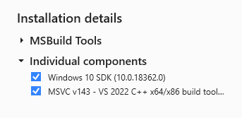

# Friday Night Funkin' - Codename Engine (WIP)

## PLEASE NOTE - THIS IS STILL IN A BETA STATE

Early alpha of Codename Engine, known issues:
- Some options are missing
- Week 5 has no monster animation
- Week 6 still have no dialogue
- Week 7 have no running tankman

Build instructions are below. Press TAB on the main menu to switch mods.

Also, `lime test windows` uses the source assets folder instead of the export one.

## CREDITS
- Credits to [Ne_Eo](https://twitter.com/Ne_Eo_Twitch) and the [3D-HaxeFlixel](https://github.com/lunarcleint/3D-HaxeFlixel) repository for Away3D Flixel support
- Credits to Smokey555 for the fancy Animate Atlas code (might be replaced soon)

  
<h2>How to build</h2>

### **Open the instructions for your platform**

    
<h3>Windows</h3>

##### Tested on Windows 10 21H2
1. Install the [latest version of Haxe](https://haxe.org/download/).
2. Download [Visual Studio Build Tools](https://aka.ms/vs/17/release/vs_BuildTools.exe)
3. Wait for the Visual Studio Installer to install
4. On the Visual Studio installer screen, go to the "Individual components" tab and only select those options:
    - MSVC v143 VS 2022 C++ x64/x86 build tools (Latest)
    - Windows 10/11 SDK (any works)
5. This is what your Installation details panel should look like. Once correct, press "Install".
    - ⚠ This will download around 1.07 GB of data from the internet, and will require around 5.5 GB of available space on your computer.

6. Once the installation is done, close Visual Studio Installer.
7. Download and install [`git-scm`](https://git-scm.com/download/win).
    - Leave all installation options as default.
8. Open the Codename Engine source folder, click on the address bar and type `cmd` to open a command prompt window.
9. On the command prompt, run `update.bat`, and wait for the libraries to install.
10. Once the libraries are installed, run `haxelib run lime test windows` to compile and launch the game (may take a long time)
    - ℹ You can run `haxelib run lime setup` to make the lime command global, allowing you to execute `lime test windows` directly.

            

